# What is GLTF

- [원문 ~ Khronos Group's gltfOverview](https://raw.githubusercontent.com/KhronosGroup/glTF/main/specification/2.0/figures/gltfOverview-2.0.0b.png)

## Overview

**glTF**는 [Khronos Group](https://github.com/KhronosGroup)에 의해 디자인 및 정의된 것으로, **네트워크를 통한 3D 컨텐츠의 효율적인 전송**을 위한 것이다.
glTF의 코어는 JSON 파일이며, 3D 모델들을 포함한 하나의 씬 구조와 구성을 나타낸다.

> scenes, nodes - 씬의 기본 구조
>
> cameras - 씬의 뷰 설정
>
> meshes - 3D 오브젝트의 기하학적 구조 (=Geometry)
>
> buffers, bufferViews, accessors - 데이터 레퍼런스와 데이터 레이아웃 설명
>
> materials - 어떻게 오브젝트가 렌더링되어야 하는지에 대한 정의
>
> textures, images, samplers - 오브젝트의 표면 모양
>
> skins - 버텍스 스키닝을 위한 정보
>
> animations - 시간 경과에 따른 프로퍼티 변경

이러한 요소들은 배열에 포함되어 있으며, 오브젝트 간의 참조는 인덱스를 통해 이루어진다.

또한, 모든 에셋을 하나의 단일 바이너리 glTF 파일로 저장하는 것이 가능하다.(=glb) 이 경우, JSON 데이터는 버퍼 또는 이미지의 바이너리 데이터에 해당하는 문자열로 저장된다.

## Concepts

glTF 에셋의 탑-레벨 요소 간 관계는 아래와 같다.

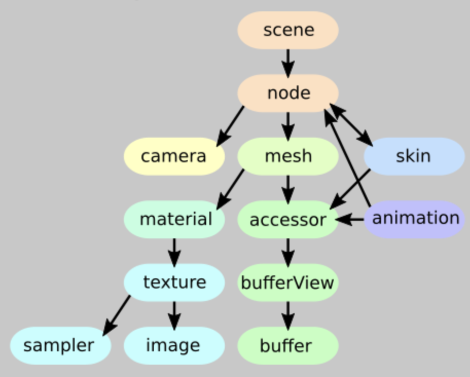

### 바이너리 데이터 참조

glTF 에셋의 이미지와 버퍼는 외부 파일을 참조할 수 있다.

```JSON
"buffers": [
  {
    "uri": "buffer01.bin",
    "byteLength": 102040,
  },
],
"images": [
  {
    "uri": "image01.png"
  }
]
```

**buffers**는 지오메트리 또는 애니메이션 데이터를 포함하는 바이너리 파일을 가리킨다.

**images**는 모델의 텍스쳐 데이터를 담고있는 이미지 파일을 가리킨다.

데이터는 URI를 통해 참조될 수 있으나, 데이터 URI를 통해 JSON 내에서 직접 추가될 수도 있다. 데이터 URI는 아래의 형태로 MIME 타입을 정의하며, base64 인코딩된 데이터를 포함한다.

```JSON
// Buffer data:
"data:application/gltf-buffer;base64,AAABAAIAAgA..."

// Image data:
"data:image/png;base64,iVBORw0K..."
```

## Scenes, Nodes

glTF JSON은 **씬**(**scene**)들을 포함할 수 있다. (+ 선택적으로, 기본 씬을 설정)

각각의 씬은 노드의 인덱스 목록을 포함할 수 있다. 각각의 **노드**는 자식(**children**)의 인덱스 목록을 포함할 수 있다.

```JSON
"scene": 0,
"scenes": [
  {
    "nodes": [0, 1, 2] // 해당 씬이 루트가 됨
  }
],
"nodes": [
  {
    "children": [3, 4], // 첫번째 씬에 의해 참조
    ...
  }
  {
    ...
  },
  {
    ...
  },
  {
    ... // 첫번째 노드에 의해 참조
  },
  {
    ... // 첫번째 노드에 의해 참조
  }
]
```

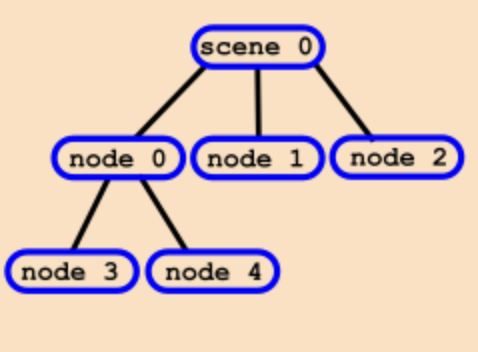

하나의 노드는 하나의 로컬 트랜스폼을 포함할 수 있다. 이는 하나의 열 우선(column-major) **행렬** 배열로 주어지거나, 각각의 **변환**(**translation**), **회전**(**rotation**), **스케일**(**scale**)로 전달될 수 있다.

이 때, rotation은 쿼터니언의 형태로 전달된다.

이로부터, 한 노드의 전역 트랜스폼은 루트에서 각 노드까지의 경로에 있는 모든 로컬 트랜스폼의 곱을 통해 구할 수 있다.

```JSON
"nodes": [
  {
    // 하나의 행렬로 주어지거나
    "matrix": [
      1.0, 0.0, 0.0, 0.0,
      0.0, 1.0, 0.0, 0.0,
      0.0, 0.0, 1.0, 0.0,
      1.0, 2.0, 3.0, 1.0
    ],
    // ...
  },
  { // 또는 TRS를 각각 따로 전달
    "translation": [1.0, 2.0, 3.0],
    "rotation": [0.0, 0.0, 0.0, 1.0],
    "scale": [1.0, 1.0, 1.0],
    // ...
  }
]
```

각 노드는 하나의 메시 또는 카메라를 가리킬 수 있다. 이는 각각의 **메시**(**mesh**)와 **카메라**(**camera**)의 인덱스로 전달된다.

해당 요소들은 이 노드에 연결되며, 이 요소의 인스턴스들은 생성된 이후 노드의 전역 트랜스폼에 기반하여 트랜스폼된다.

```JSON
"nodes": [
  {
    "mesh": 4,
    // ...
  },
  {
    "camera": 2,
    // ...
  }
]
```

노드의 TRS 프로퍼티는 한 애니메이션의 타겟이 될 수도 있다. 이 경우 애니메이션은 시간의 경과에 따라 한 속성이 어떻게 변화하는지에 대해 정의한다.
연결된 오브젝트들은 이를 따라, 움직이는 오브젝트 또는 카메라 비행을 모델링할 수 있다.

노드들은 **버텍스 스키닝**(**Vertex Skinning**)에 사용될 수도 있다. 한 노드 구조는 한 애니메이션 캐릭터의 스켈레톤을 정의할 수 있다.
이 경우, 노드는 하나의 메쉬와 하나의 스킨을 참조하게 되며, 참조된 스킨은 현재의 스켈레톤 포즈에 기반하여 메쉬가 어떻게 **디폼**(**deform**)되는지에 대한 추가적인 정보를 담게 된다.

## Meshes

**메쉬**(**mesh**)는 하나 이상의 **프리미티브**(**primitive**)를 포함한다.
프리미티브는 메쉬를 렌더링하는데에 필요한 기하학적 데이터를 참조한다.

```JSON
"meshes": [
  {
    "primitives": [
      {
        "mode": 4,
        "indices": 3,
        "attributes": {
          "POSITION": 0,
          "NORMAL": 2,
        },
        "material": 0
      }
    ]
  }
]
```

각각의 메쉬 프리미티브는 렌더링 **모드**를 갖는다. 이는 렌더링이 `POINTS`, `LINES`, `TRIANGLES` 등 어떤 방식으로 이루어지는지를 정의한다.

프리미티브는 또한 이 데이터에 대한 액세서의 인덱스를 사용하여 **인덱스**(**index, indices**)와 버텍스의 **어트리뷰트**(**attributes**)을 참조한다.

렌더링에 사용될 **머테리얼**(**material**) 역시 주어져야 하며, 이는 머테리얼의 인덱스로 전달된다.

각 어트리뷰트는 어트리뷰트 데이터를 포함하는 액세서의 인덱스와 어트리뷰트명을 매핑하여 정의된다. (ex. `POSITION`은 `0`번 액세서를 참조한다.)
이 데이터는 메쉬를 렌더링할 때 버텍스 어트리뷰트로 사용된다.

예를 들어, 버텍스들의 `POSITION`과 `NORMAL`을 정의하는 어트리뷰트는 다음의 형태가 된다.

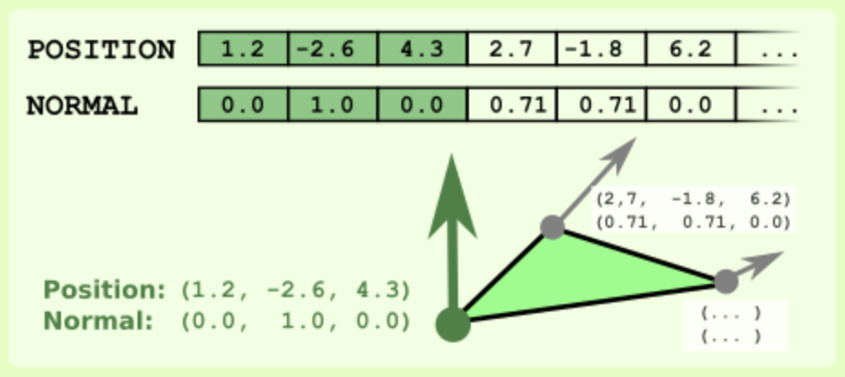

메쉬는 여러 개의 **모프 타겟**(**Morph Target**)을 정의할 수 있다. 이러한 모프 타겟은 원본 메쉬의 디포메이션을 정의한다.

```JSON
{
  "primitives": [
    {
      ...
      "targets": [
        {
          "POSITION": 11,
          "NORMAL": 13,
        },
        {
          "POSITION": 21,
          "NORMAL": 23
        }
      ]
    }
  ],
  "weights": [0, 0.5]
}
```

메쉬에 모프 타깃을 정의하기 위해, 각각의 메쉬 프리미티브는 **타겟**(**target**)의 배열을 가질 수 있다.

이는 어트리뷰트의 명칭을 대상 지오메트리의 변위(displacement)를 포함하는 액세서의 인덱스에 매핑하는 딕셔너리다.

메쉬는 또한 **가중치**(**weight**)의 배열을 가질 수 있고, 이는 각 모프 타깃이 최종적으로 렌더링되는 메시의 상태에 어느 정도 기여할 것인지를 정의한다.

다른 가중치를 가진 여러 개의 모프 타깃을 조합하는 것도 가능하다.
예를 들어, 한 캐릭터의 다양한 표정에 대한 모델링을 하는 경우가 이에 해당한다. 이 때는 애니메이션으로 가중치를 수정하여 지오메트리의 여러 상태 간에 보간할 수 있다.

## Buffers, BufferViews, Accessors

**버퍼**(**buffer**)는 3D 모델, 애니메이션, 스키닝에서 기하학적으로 사용되는 데이터를 담고 있다.

**버퍼 뷰**(**bufferView**)는 이 데이터의 구조적인 정보를 포함한다.

**액세서**(**accessor**)란 데이터의 정확한 타입과 레이아웃을 정의한다.

```JSON
"buffers": [
  {
    "byteLength": 35,
    "uri": "buffer01.bin"
  }
],
"bufferViews": [
  {
    "buffer": 0, // 위쪽 buffers 배열의 첫번째를 참조
    "byteOffset": 4,
    "byteLength": 28,
    "byteStride": 12,
    "target": 34963,
  }
],
"accessors": [
  {
    "bufferView": 0, // 위쪽 bufferViews 배열의 첫번째를 참조
    "byteOffset": 0,
    "type": "VEC2",
    "componentType": 5126,
    "count": 2,
    "max": [0.1, 0.2],
    "min": [0.9, 0.8]
  }
]
```

각각의 **버퍼**는 URI를 통해 바이너리 데이터 파일을 참조한다.
이는 주어지는 byteLength의 길이를 가진 raw data 한 블록의 소스에 해당한다.

각각의 **버퍼 뷰**는 하나의 버퍼를 참조한다.
여기에는 **byteOffest**과 **byteLength**가 포함되어 있으며, 이는 해당 버퍼 뷰에 해당되는 버퍼의 부분을 정의한다. 또, 옵셔널한 OpenGL 버퍼 **타겟**(**target**)을 가질 수 있다.

**액세서**는 버퍼 뷰의 데이터가 어떻게 해석되어야 하는지를 정의한다.
여기서 버퍼 뷰의 시작을 나타내는 추가적인 **byteOffset**을 가질 수 있으며, 버퍼 뷰 데이터의 타입과 레이아웃에 대한 정보를 포함한다.

위의 예시의 경우, **type**이 `VEC2`이고, `componentType`이 `5126`(= `GL_FLOAT`)이므로, 부동소수점 값의 2D 벡터가 정의된다. 모든 값의 범위는 `min`과 `max` 속성을 통해 정의된다.

여러 개의 액세서를 가진 데이터는 버퍼뷰 내부에서 **인터리빙**(**interleave**)될 수 있다. 이 경우, 버퍼 뷰는 **byteStride** 속성을 가지며, 이는 액세서의 한 요소의 시작점과 다음 요소의 시작점 만큼의 바이트 간격을 의미한다.

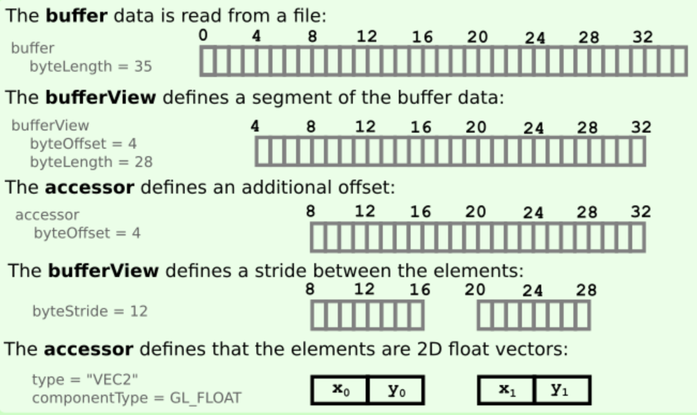

위의 경우를 예시로 들면, 해당 데이터는 2D 텍스쳐 좌표에 엑세스하기 위한 메쉬 프리미티브로써 사용될 수 있다.
**bufferView** 데이터는 `glBindBuffer`를 사용하여 OpenGL buffer로 바운드할 수 있다.
이 경우, **accessor**의 프로퍼티들은 `glVertexAttribPointer`에 전달하여 bufferView의 buffer가 바운딩 되었을 때, 이 buffer를 버텍스 어트리뷰트 데이터로 정의하기 위해 사용될 수 있다.

### Sparse Accessors

**액세서**의 일부 요소만이 기본값과는 다른 경우, (주로 모프 타겟에서) `sparse`를 통해 매우 컴팩트하게 데이터를 전달할 수 있다.

액세서는 데이터의 타입(여기서는 스칼라 float값)과 전체 요소의 `count`를 정의한다.

**sparse** 데이터는 sparse 데이터 블록이 포함하는 sparse 데이터 요소의 `count`를 포함한다.

**values**는 sparse 데이터 값을 포함하는 bufferView를 참조한다.

sparse 데이터 값에 대한 타겟 **indices**는 bufferView와 **componentType**에 대한 참조로 정의된다.

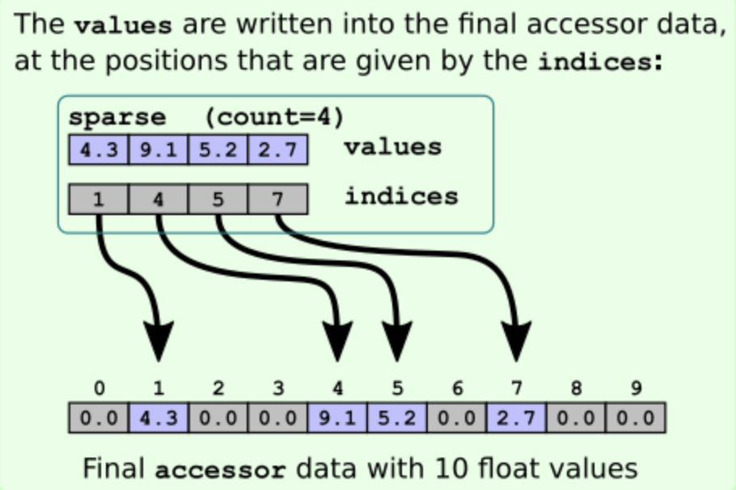

위의 예시 이미지 처럼, `values`는 주어진 `indices`의 위치에 따라 최종 액세서 데이터를 덮어씌운다.

## materials

각 메쉬 프리미티브는 glTF 에셋 내에 포함된 **머테리얼**(**material**) 중 하나를 참조할 수 있다.
머테리얼은 오브젝트가 어떻게 렌더링 되어야 하는지에 대해 물리적 머테리얼 속성들에 기반하여 정의한다.
이를 통해 **PBR**(**Physically Based Rendering**) 테크닉을 적용할 수 있으며, 저마다 다른 렌더러들 간에도 렌더된 오브젝트의 형상이 일정하도록 보장해준다.

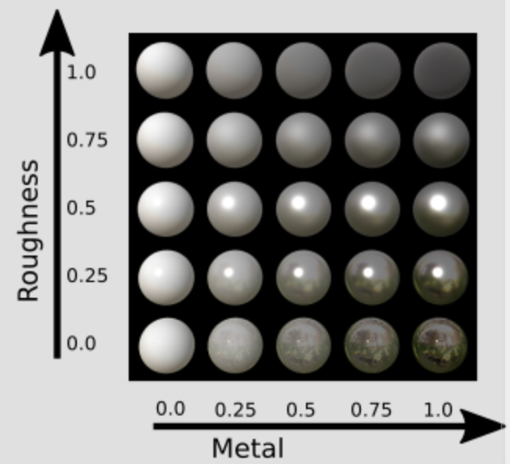

기본 머테리얼 모델은 **Metallic-Roughness-Model**이며, 이는 각각 `0`에서 `1` 사이의 값으로 오브젝트의 표면이 얼마나 금속같은지, 얼마나 거친지에 대한 재질 특성을 나타낸다.
이 속성들은 오브젝트 전체에 단일한 값으로 적용될 수도 있고, 텍스처에 의해 참조될 수도 있다.

```JSON
"materials": [
  {
    "pbrMetallicRoughness": {
      "baseColorTexture": {
        "index": 1,
        "texCoord": 1
      },
      "baseColorFactor": [1.0, 0.75, 0.35, 1.0],
      "metallicRoughnessTexture": {
        "index": 5,
        "texCoord": 1,
      },
      "metallicFactor": 1.0,
      "roughnessFactor": 0.0,
    },
    "normalTexture": {
      "scale": 0.8,
      "index": 2,
      "texCoord": 1
    },
    "occlusionTexture": {
      "strength": 0.9,
      "index": 4,
      "texCoord": 1
    },
    "emissiveTexture": {
      "index": 3,
      "texCoord": 1
    },
    "emissiveFactor": [0.4, 0.8, 0.6]
  }
]
```

Metallic-Roughness-Model 머테리얼은 **pbrMetallicRoughness** 객체에 정의된다.

**baseColorTexture**는 오브젝트에 적용될 메인 텍스처다.
**baseColorFactor**는 색의 RGBA에 대한 스케일링 팩터를 담고 있다.
따로 텍스처가 사용되지 않는다면, 오브젝트 전체가 해당 색이 적용될 것이다.

**metallicRoughnessTexture**는 "blue" 컬러 채널에 metalness 값을, "green" 컬러 채널에 roughness 값을 담고 있는 텍스처를 의미한다.
**metallicFactor**와 **roughnessFactor**는 이러한 값에 해당 수치 만큼 곱셈을 적용한다.
따로 텍스처가 주어지지 않는다면, 오브젝트 전체에 해당 reflection 특성이 적용된다.

Metallic-Roughness-Model을 통해 정의된 프로퍼티들에 더해, 머테리얼은 오브젝트 형상에 적용될 다른 프로퍼티들도 포함할 수 있다.

- **normalTexture**는 접선공간(tangent-space)의 법선 정보를 담고 있는 텍스처를 참조하며, 이러한 노말에 적용될 **scale** 팩터가 같이 사용된다.
- **occlusionTexture**는 빛으로부터 차단되어(occluded) 더 어둡게 렌더되어야 하는 표면 영역에 대한 텍스처를 참조한다. 해당 정보는 텍스처의 "red" 컬러 채널을 사용한다. 오클루전의 **strengh**는 해당 값에 적용될 스케일링 팩터의 역할을 한다.
- **emessiveTexture**는 오브젝트 표면에서 발광(illuminate)을 일으키는 부분을 나타내는 텍스처를 참조하며, 해당 텍스처에서는 표면에서 빛나게 될 부분과, 그 빛의 색을 정의한다. **emissiveFactor**는 이 텍스처의 RGB에 곱해지는 스케일링 팩터에 해당한다.

### Material Properties in textures

```JSON
"meshes": [
  {
    "primitives": [
      {
        "material": 2, // 아래의 index 2에 해당하는 `brushed gold` 머테리얼을 참조
        "attributes": {
          "NORMAL": 3,
          "POSITION": 1,
          "TEXCOORD_0": 2,
          "TEXCOORD_1": 5 // 아래 머테리얼의 `pbrMetallicRoughness.baseColorTexture.texCoord`에 의해 참조
        },
      }
    ]
  }
]
```

```JSON
"materials": [
  ...
  {
    "name": "brushed gold",
    "pbrMetallicRoughness": {
      "baseColorFactor": [1, 1, 1, 1],
      "baseColorTexture": {
        "index": 1, // 아래 쪽의 index 1의 텍스처를 참조
        "texCoord": 1 // 위의 `TEXCOORD_1`을 참조
      },
      "metallicFactor": 1.0,
      "roughnessFactor": 1.0
    }
  }
]
```

```JSON
"textures": [
  ...
  { // 해당 텍스처는 위쪽의 `material.baseColorTexture.index`에 의해 참조됨
    "source": 4,
    "sampler": 2
  }
]
```

하나의 머테리얼 내 텍스처 참조는 항상 텍스처의 **index**를 포함해야 한다.
또, 특정 index가 설정된 **texCoord**를 포함하기도 한다.
이는 해당 텍스처의 텍스처 좌표(coordinate)를 포함하는 메쉬 프리미티브의 어트리뷰트(`TEXCOORD_<n>`)를 결정하는 값이며, 이는 기본값으로는 `0`이다.

## Cameras

각 노드에 glTF 에셋에 정의된 **카메라** 중 하나를 참조할 수 있다.

```JSON
"cameras": [
  {
    "type": "perspective",
    "perspective": {
      "aspectRatio": 1.5,
      "yfov": 0.65,
      "zfar": 100,
      "znear": 0.01
    }
  },
  {
    "type": "orthographic",
    "orthographic": {
      "xmag": 1.0,
      "ymag": 1.0,
      "zfar": 100,
      "znear": 0.01
    }
  }
]
```

카메라에는 두가지 타입, **perspective**와 **orthographic**이 있으며, 이는 프로젝션 매트릭스(projection matrix)를 정의한다.

**zfar**는 perspective 카메라의 far clipping plane 거리의 값에 해당하며, 이는 옵셔널하다.
해당 값이 없다면, 카메라가 무한한 프로젝션에 사용되는 특별한 프로젝션 매트릭스를 사용된다.

한 노드가 한 카메라를 참조할 때, 카메라 인스턴스가 생성된다.
이 인스턴스의 카메라 매트릭스는 곧 노드의 전역 트랜스폼 매트릭스에 전달된다.

## Textures, Images, Samplers

**textures**는 렌더될 오브젝트에 적용될 텍스처에 대한 정보를 담는다.
머테리얼은 오브젝트의 기본 컬러 뿐만 아니라 오브젝트 형상에 영향을 미칠 물리적 속성을 정의하기 위해서 텍스처를 참조한다.

```JSON
"textures": [
  {
    "source": 4, // 아래의 index 4에 해당하는 `file01.png` 이미지를 참조
    "sampler": 2 // 아래의 index 2에 해당하는 `samplers`를 참조
  }
  ...
]
```

```JSON
"images": [
  ...
  {
    "uri": "file01.png"
  },
  {
    "bufferView": 3,
    "mimeType": "image/jpeg"
  }
]
```

```JSON
"samplers": [
  ...
  {
    "magFilter": 9729,
    "minFilter": 9987,
    "wrapS": 10497,
    "wrapT": 10497
  }
]
```

텍스처는 에셋 이미지 중 하나를 가리키는 텍스처 소스(**source**)에 대한 참조와, 샘플러(**sampler**)에 대한 참조로 구성된다.

**images**는 텍스처에 사용될 이미지 데이터를 정의한다.
이 데이터는 이미지 파일 위치를 가리키는 **uri** 속성을 통해 참조할 수도 있고, **bufferView**에 대한 참조와 버퍼 뷰에 저장된 이미지 데이터의 타입을 정의하는 **MIME Type** 속성을 통해 참조할 수도 있다.

**samplers**는 텍스처의 스케일링과 텍스처 좌표의 래핑을 정의한다. (= `glTexParameter`에 넘겨지는 OpenGL 상수값)

## Skins

glTF 에셋은 버텍스 스키닝을 수행하는 데에 있어 필수적인 정보들을 담을 수 있다.
버텍스 스키닝은 현재 pose에 기반한 스켈레톤의 bones에 따라 메쉬의 버텍스를 변형할 수 있도록 해준다.

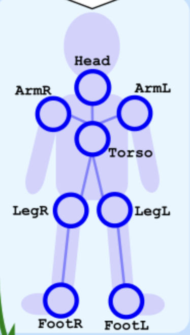

```JSON
"nodes": [
  {
    "name": "Skinned mesh node",
    "mesh": 0,
    "skin": 0,
  },
  ...
  {
    "name": "Torso",
    "children": [2, 3, 4, 5, 6],
    "rotation": [...],
    "scale": [...],
    "translation": [...]
  },
  ...
  {
    "name": "LegL",
    "children": [7],
  },
  ...
  {
    "name": "FootL",
    ...
  },
  ...
],
```

```JSON
"meshes": [
  "primitives": [
    { // 위쪽 첫번째 노드인 "Skinned mesh node"가 참조하는 mesh
      "attributes": {
        "POSITION": 0,
        "JOINTS_0": 1,
        "WEIGHTS_0": 2
        ...
      }
    }
  ]
]
```

```JSON
"skins": [
  { // 위쪽 첫번째 노드인 "Skinned mesh node"가 참조하는 skin
    "inverseBindMatrices": 12,
    "joints": [1, 2, 3 ...],
  }
]
```

하나의 노드는 **mesh**를 참조할 수 있고, 또한 **skin**을 참조할 수도 있다.

**skins**는 **joints**의 배열을 담고 있으며, 이는 스켈레톤 구조를 정의하는 노드들의 인덱스를 의미한다.
또, **inverseBindMatrices**는 각 joint 당 하나의 매트릭스를 포함하는 액세서에 대한 참조를 의미한다.

스켈레톤 구조는 씬 구조와 마찬가지로 노드에 의해 구성된다.
각 joint 노드는 로컬 트랜스폼과 자식 배열, 그리고 joint 간의 연결로서 스켈레톤의 "뼈대(bones)"를 간접적으로 정의한다.

스키닝된 메쉬의 메쉬 프리미티브는 `POSITION` 어트리뷰트를 가지는데, 이는 버텍스 위치에 대한 액세서를 나타낸다.

그 외에 두가지 특별한 어트리뷰트가 스키닝에 요구되는데, 이는 `JOINTS_0`와 `WEIGHTS_0`이다. 이는 각각 하나의 액세서를 참조한다.

`JOINT_0` 어트리뷰트 데이터는 버텍스에 영향을 주어야 하는 joint의 인덱스를 나타내는 값이다.

`WEIGHT_0` 어트리뷰트 데이터는 버텍스에 영향을 주어야 하는 joint의 가중치를 나타내는 값열이다.

이러한 정보들을 바탕으로, **스키닝 매트릭스**(**skinning matrix**)가 계산될 수 있다.
이에 대한 디테일은 아래의 **Computing the skinning matrix** 섹션에서 설명한다.

## Computing the skinning matrix

스키닝 매트릭스는 스켈레톤의 현재 포즈에 기반하여 메쉬의 버텍스가 어떻게 변형될지를 나타내는 매트릭스이다.
스키닝 매트릭스는 조인트 매트릭스(joint matrix)들의 가중치를 적용한 합에 해당한다.

### Computing the joint matrices

스킨은 **inverseBindMatrices**를 참조한다.
이는 각 joint에 대한 역행렬을 포함하는 액세서를 나타낸다.
이 매트릭스들은 메쉬를 조인트의 로컬 공간으로 변환시키는 데 사용된다.

스킨의 **joints**에 포함된 인덱스에 해당하는 각각의 노드에 대해, 전역 트랜스폼 매트릭스를 계산할 수 있다.
이는 조인트의 현재 글로벌 트랜스폼을 기반으로 조인트의 로컬 공간으로부터 메쉬를 변형하며, 이를 **globalJointTransform**이라고 한다.

이 매트릭스들로부터, **jointMatrix**는 각 조인트에 대해 다음과 같이 계산될 수 있다.

```
jointMatrix[j] = inverse(globalTransform) * globalJointTransform[j] * inverseBindMatrix[j]
```

![inverseBindMatrix\[1\]](image-7.png)

![globalJointTransform\[1\]](image-8.png)

메쉬와 스킨을 포함하는 노드의 모든 글로벌 트랜스폼은 조인트 행렬에 이 트랜스폼의 역을 미리 곱하여 상쇄한다.

OpenGL 또는 WebGL에 기반한 구현의 경우, **jointMatrix** 배열은 버텍스 셰이더에 유니폼으로서 전달된다.

### Combining the joint matrices to create the skinning matrix

스키닝된 메쉬의 프리미티브는 `POSITION`, `JOINT`, `WEIGHT` 어트리뷰트들을 포함하며, 이들은 모두 액세서들을 참조한다.
이 액세서들은 각 버텍스마다 하나의 요소를 포함한다.

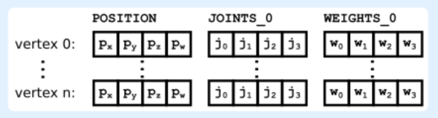

이 액세서들의 데이터는 `jointMatrix` 배열과 함께 버텍스 셰이더에 어트리뷰트로 전달된다.

버텍스 셰이더에서는 `skinMatrix`가 계산된다.
이는 인덱스가 `JOINTS_0` 어트리뷰트에 포함된 조인트 행렬의 선형 조합(linear combination)으로, `WEIGHTS_0`값으로 가중치가 부여된다.

```glsl
// Vertex Shader

uniform mat4 u_jointMatrix[12];
attribute vec4 a_position;
attribute vec4 a_joint;
attribute vec4 a_weight;

...

void main(void) {
  ...
  mat4 skinMatrix = 
    a_weight.x * u_jointMatrix[int(a_joint.x)] +
    a_weight.y * u_jointMatrix[int(a_joint.y)] +
    a_weight.z * u_jointMatrix[int(a_joint.z)] +
    a_weight.w * u_jointMatrix[int(a_joint.w)];

  gl_Position = modelViewProjection * skinMatrix * position;
}
```

model-view-perspective 매트릭스로 변형하기 전에, `skinMatrix`가 먼저 스켈레톤 포즈에 기반하여 버텍스를 변형한다.

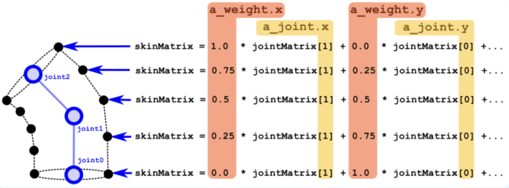


## Animations

glTF 에셋은 **애니메이션**(**animations**)을 포함할 수 있다.
애니메이션은 노드의 로컬 트랜스폼이 정의된 노드의 프로퍼티 또는 모프 깃의 가중치에 적용될 수 있다.

```JSON
"animations": [
  {
    "channels": [
      {
        "target": {
          "node": 1,
          "path": "translation"
        },
        "sampler": 0 // 아래의 samplers[0]을 참조
      }
    ],
    "samplers": [
      {
        "input": 4,
        "interpolation": "LINEAR",
        "output": 5
      }
    ]
  }
]
```

각각의 애니메이션은 두 요소를 갖는다. 하나의 **채널**(**channels**) 배열과 하나의 **샘플러**(**samplers**) 배열이다.

각 채널은 애니메이션의 **타겟**(**target**)을 정의한다. 이 타겟은 대부분 인덱스를 통해 하나의 **노드**(**node**)를 참조하고, **패스**(**path**)는 해당 노드의 어떤 프로퍼티가 애니메이션의 대상인지를 정의한다. 
패스는 노드에 로컬 트랜스폼을 적용하는 `translation`, `rotation`, 또는 `scale`이 되거나, 또는 노드에 의해 참조되는 메쉬의 모프 타겟의 가중치에 애니메이션을 적용하기 위해선 `weights`가 된다.
채널은 또한 하나의 **샘플러**(**sampler**)를 참조하며, 이는 실제 애니메이션 데이터를 요약한다.

샘플러는 **입력**(**input**)과 **출력**(**output**)을 가지며, 데이터를 제공하는 액세서의 인덱스를 통해 참조한다. 
input은 스칼라 부동소수점을 가진 액세서를 참조하며, 애니메이션의 키프레임에 해당하는 시간들에 해당한다.
output은 각 키프레임에서 애니메이션이 적용되는 프로퍼티 값을 담고 있는 액세서를 참조한다.
샘플러는 또한 애니메이션의 **보간**(**interpolation**) 모드를 정의하며, 여기서는 `LINEAR`, `STEP`, `CUBICSPLINE`이 될 수 있다.

### Animation samplers

애니메이션이 진행되는 동안에, "전역(global)" 애니메이션 시간이 초 단위로 증가한다.

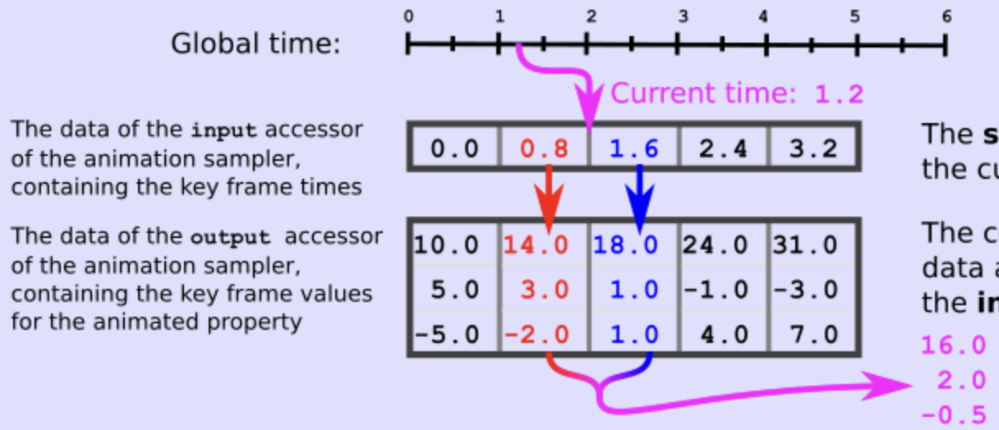

애니메이션 샘플러의 `input` 액세서의 데이터는 키 프레임 시간을 담고있다.

애니메이션 샘플러의 `output` 액세서의 데이터는 애니메이션이 적용된 프로퍼티의 키 프레임 값을 담고있다.

**sampler**는 **input** 데이터에서 현재 시간에 대한 키프레임을 탐색한다.

**output** 데이터에서 해당 키프레임에 상응하는 데이터를 읽고, 샘플러의 **interpolation** 모드에 따라 적절한 방식으로 보간한다.

보간된 값은 애니메이션 채널의 **타겟**에 적용된다.

### Animation channel targets

애니메이션 샘플러로부터 전달되는 보간된 값은 다른 형태의 애니메이션 채널 타겟에 따라 다른 형태로 적용된다.

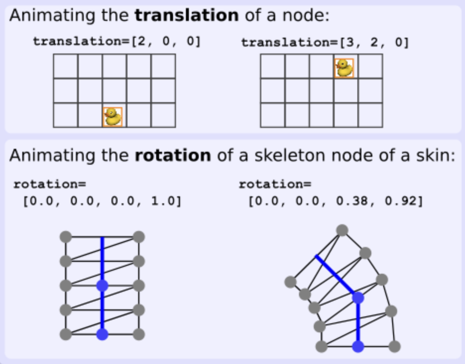

노드에 연결된 메쉬의 프리미티브에 정의된 모프 타깃에 적용된 **weights** 애니메이션은 다음과 같은 형태로 동작한다.

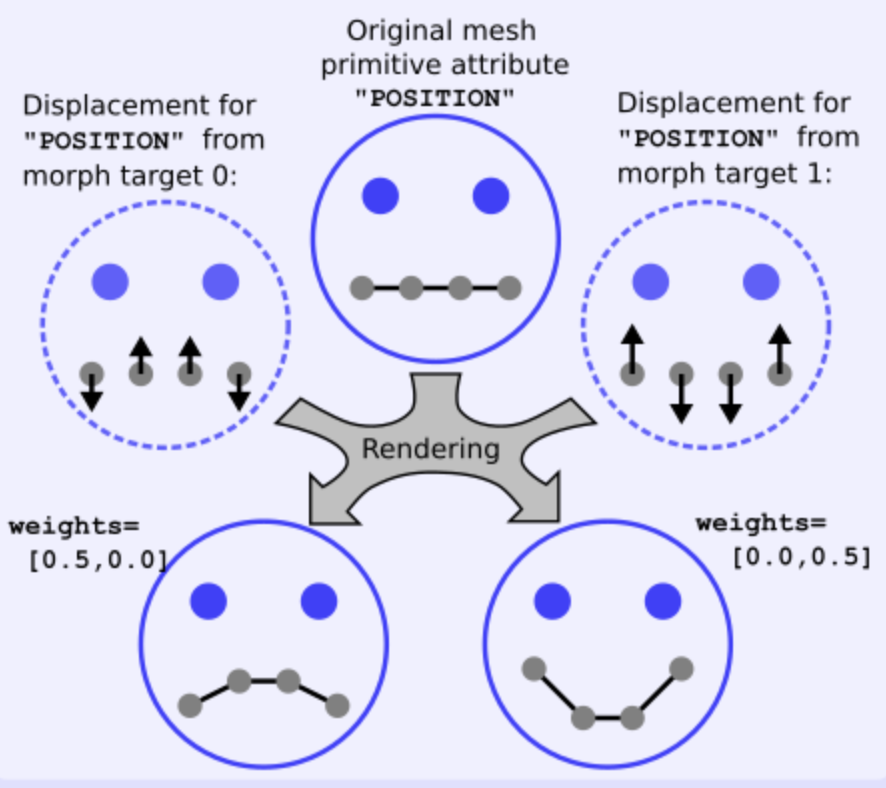
